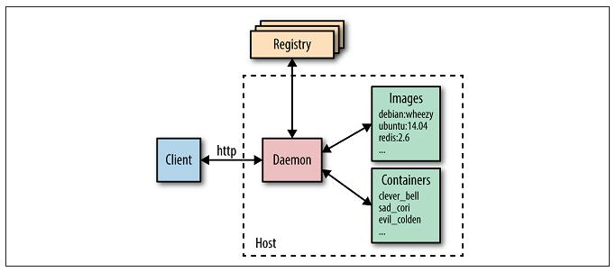

# Docker introduction

* Docker concepts
    * **Build, share, and run** applications with containers
    * **Flexible**: Even the most complex applications can be containerized.
    * **Lightweight**: Containers leverage and share the host kernel, 
    making them much more efficient in terms of system resources than virtual machines.
    * **Portable**: You can build locally, deploy to the cloud, and run anywhere.
    * **Loosely coupled**: Containers are highly self sufficient and encapsulated, 
    allowing you to replace or upgrade one without disrupting others.
    * **Scalable**: You can increase and automatically distribute container replicas across a datacenter.
    * **Secure**: Containers apply aggressive constraints and isolations to processes 
    without any configuration required on the part of the user.
    * Virtual machine have overhead - operation system
    * Docker container runs natively on Linux and shares the kernel, without overhead
* Terminology
    * **image** - **immutable** snapshot private filesystem
    * **container** - isolation running process, networking with private filesystem
    * **docker daemon** - background service
    * **docker client** - command line tool that allows the user to interact with the daemon
    * **Dockerfile**
    * **docker hub** - default registry of Docker images
* Docker **architecture**


    
    * Daemon (docker host, cgroups, namespaces)
    * CLI
    * Registry (storage of the images)
    
* Dockerfile commands syntax
    * ```FROM``` ```FROM ubuntu:19.04``` [docker hub](https://hub.docker.com/layers/ubuntu/library/ubuntu/19.04/images/sha256-a65d3401e785fbc3192f0046f68e6487134b70ec9ba79a956fecba9122b39378)
    * ```RUN``` ```RUN ls -la .```
    * ```WORKDIR``` ```WORKDIR /opt/my-app```
    * ```COPY``` or ```ADD``` ```COPY package.json .```
    * ```EXPOSE``` ```EXPOSE 80```
    * ```ENTRYPOINT``` ```ENTRYPOINT dotnet my-app.dll```
    * ```ENV``` ```ENV DB_PORT 3206```
    * ```LABEL``` ```LABEL version="1.0"``` - for docker inspect, docker ps
* Docker **build context**
    * ```docker context``` is not a **build context**
    * What is context of the docker daemon?
        * File system cache
    * What is the purpose of the Docker build context?
        * Because the client and daemon may not even run on the same machine
        * ```COPY```, ```ADD``` move files from context to result image 
    * **with .git** folder ```Sending build context to Docker daemon 9.58MB```
    * **without .git** folder ```Sending build context to Docker daemon  4.952MB```
    * Build with different context type 
        * from filesystem ```docker build -t gs .```
        * from git ```docker build -t gs http://globalsearch.git```
        * from .tar.gz ```docker build -t gs globalsearch.tar.gz```
    * ```.dockerignore``` - ignoring files that sending to build context
    * **Warning**: Do not use your root directory, ```/```, as the ```PATH``` as it causes the build
     to transfer the entire contents of your hard drive to the Docker daemon.
* Docker **cache** 
    * Lifecycle of the cache
        * ```ADD```, ```COPY``` - trigger calculate hash sum of the files in the build context (ignore date modified)  
        * ```RUN``` - not checking files in the image container, like ```RUN apt-get -y update``` [demo](examples/cache/Dockerfile)
    * .dockerignore
        * **be careful** - always exclude ```.git``` ```.idea```, ```.DS_Store``` of mac os, etc.
        * [demo - exclude .DS_Store](.dockerignore)
* Docker run container
    * binding ports ```docker run -d -p 8000:80 nginx```
    * binding volumes ```docker run -d -v /tmp:/var/www nginx```
    * links ```docker run --link myredis:redis debian env```
* Debugging build steps of the Dockerfile
    * ```docker run -it 7831e2ca1809```
* Debug running container 
* BuildKit
    * Benchmarks
    * Difference build context
        * ```--mount=type=*```

### Links 

* [Learn docker, step by step](https://docker-curriculum.com/)
* [container and lightweight virtualization](https://www.slideshare.net/janghoonsim/docker-container-and-lightweight-virtualization)
* [Основы Docker](http://onreader.mdl.ru/UsingDocker/content/Ch04.html)
