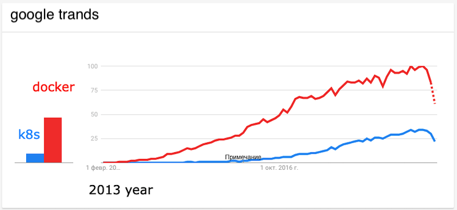

# Docker introduction



---

* **Docker history**
    
    * The world ```Docker``` comes from a British colloquialism meanings **dock** *work* **er** - somebody
     who loads and unloads cargo from ships
     
    
    
    * Modern containers started in the Linux world, and are the product of an immense amount of work from a wide variety
    of people, over a long period of time.
    * Major technologies
        * kernel namespaces
        * control groups
        * union filesystems
---

* **Docker history** -> The creator Docker

    
---

* **Docker history** -> The birth of Docker

    

    * French-born American developer Solomon Hykes, San Francisco based technology startup **dotCloud** in 2008 year
    * In 2010 dotCloud takes part in the program [Y Combinator](https://www.ycombinator.com/) and began to receive serious investments
    * In March 2013 dotCloud opened source codes
    * In six months, Docker open source repo received 6.7K+ stars on GitHub and 175 contributors
    * In September 2013 dotCloud renamed to **Docker Inc.**
    * Docker 1.0 was announced in June 2014
    * At the same time, Docker started moving towards being a complete platform
---

* **Docker history** -> The collaboration

    * Red Hat company joined to Docker project in September 2013 and using him in [OpenShift](https://www.openshift.com/) project
    * Google, Amazon and DigitalOcean quickly offered Docker support in their clouds
    * In October 2014, Microsoft announced that future versions of Windows Server would support Docker
    * In December 2014, DockerCon EU saw the announcement of Docker Swarm and Docker Machine
    * In December 2014, CoreOS announced the development of [rkt](https://coreos.com/rkt/), its own container support tool and
    developing the appc container specification **appc**
    * In July 2015, on DockerCon in San Francisco, Solomon Hakes from Docker and Alex Polvy from CoreOS announced
     [OCI](https://www.opencontainers.org/)
    * In July 2015 FreeBSD announces Docker supported by FreeBSD using ZFS
    * In August 2015 Docker and Microsoft have released the Docker Engine "technical preview" for Windows Server
---

* **Docker history** -> Docker Content Trust

    * In November 2015, birth Docker Content Trust ([DCT](https://docs.docker.com/engine/security/trust/content_trust/)) technology

```bash
root@k8s:~# docker trust sign bombascter/docker-intro-ppt:latest
root@k8s:~# docker push bombascter/docker-intro-ppt:latest
root@k8s:~# docker trust inspect --pretty bombascter/docker-intro-ppt:latest

Signatures for bombascter/docker-intro-ppt:latest

SIGNED TAG          DIGEST                          SIGNERS
latest              3c273c3be36514a4af2bf54955...   bombascter

......
```
---

* **Docker history** -> Docker today

    * Docker code writing in Golang - programming language from Google
    * Open container initiative [OCI](https://www.opencontainers.org/). Born in a competition of standards between 
    Docker Inc and [CoreOs](https://en.wikipedia.org/wiki/Container_Linux)
        * The [image](https://github.com/opencontainers/image-spec) spec
        * The [runtime](https://github.com/opencontainers/runtime-spec) spec
        * The [distribution](https://github.com/opencontainers/distribution-spec) spec
    * Starting from version 1.11 the Docker conforms to the OCI runtime spec
    * Today Docker is estimated to be about **1BN $**. Last investment was 240M $ from Silicon Valley
    * Docker Inc has somewhere in the region 300-400 employers
    * The project [moby](https://github.com/moby/moby) have 56K+ stars on GitHub and 1.8K+ contributors
    * The project [docker-ce](https://github.com/docker/docker-ce) have 3.8K+ stars on GitHub and 2K+ contributors
---

* Docker **concepts**

    * **Lightweight**: Containers leverage and share the host kernel, 
    making them much more efficient in terms of system resources than virtual machines.
        * Virtual machine have overhead - operation system. Run slowly. Have big image size. Operating system license required
        * Docker container runs natively on Linux and shares the kernel, without overhead. Very fast and ultra-portable
    * **Build, share, and run** applications with containers
    * **Flexible**: Even the most complex applications can be containerized.
    * **Portable**: You can build locally, deploy to the cloud, and run anywhere.
    * **Loosely coupled**: Containers are highly self sufficient and encapsulated, 
    allowing you to replace or upgrade one without disrupting others.
    * **Scalable**: You can increase and automatically distribute container replicas across a datacenter.
    * **Secure**: Containers apply aggressive constraints and isolations to processes 
    without any configuration required on the part of the user.

---

* Terminology
    * **image** - **immutable** snapshot private filesystem
    * **container** - isolation running process, networking with private filesystem
    * **docker daemon** - background service
    * **docker client** - command line tool that allows the user to interact with the daemon
    * **Dockerfile**
    * **docker hub** - default registry of Docker images
---
    
* Docker **architecture**

    
    * Daemon (docker engine: cgroups, namespaces, capabilities, netlink, selinux, apparmor, chroot)
        * [Linux Containers LXC](https://en.wikipedia.org/wiki/LXC)
        * libcontainer
        * runc
        * containerd
    * CLI
    * Registry (storage of the images)
---
    
* **Dockerfile** commands syntax

    * ```FROM``` ```FROM ubuntu:19.04``` [docker hub](https://hub.docker.com/layers/ubuntu/library/ubuntu/19.04/images/sha256-a65d3401e785fbc3192f0046f68e6487134b70ec9ba79a956fecba9122b39378)
    * ```RUN``` ```RUN ls -la .```
    * ```WORKDIR``` ```WORKDIR /opt/my-app```
    * ```COPY``` or ```ADD``` ```COPY package.json .```
    * ```EXPOSE``` ```EXPOSE 80```
    * ```ENTRYPOINT``` ```ENTRYPOINT dotnet my-app.dll```
    * ```ENV``` ```ENV DB_PORT 3206```
    * ```LABEL``` ```LABEL version="1.0"``` - for docker inspect, docker ps
---

* Docker **build context**

    * ```docker context``` is not a **build context**
    * What is context of the docker daemon?
        * File system cache
    * What is the purpose of the Docker build context?
        * Because the client and daemon may not even run on the same machine
        * ```COPY```, ```ADD``` move files from context to result image 
    * **with .git** folder ```Sending build context to Docker daemon 9.58MB```
    * **without .git** folder ```Sending build context to Docker daemon  4.952MB```
    * Build with different context type 
        * from filesystem ```docker build -t gs .```
        * from git ```docker build -t gs http://globalsearch.git```
        * from .tar.gz ```docker build -t gs globalsearch.tar.gz```
    * ```.dockerignore``` - ignoring files that sending to build context
    * **Warning**: Do not use your root directory, ```/```, as the ```PATH``` as it causes the build
     to transfer the entire contents of your hard drive to the Docker daemon.
---

* Docker **cache** 
    * Lifecycle of the cache
        * ```ADD```, ```COPY``` - trigger calculate hash sum of the files in the build context (ignore date modified)  
        * ```RUN``` - not checking files in the image container, like ```RUN apt-get -y update``` [demo](examples/cache/Dockerfile)
    * .dockerignore
        * **be careful** - always exclude ```.git``` ```.idea```, ```.DS_Store``` of mac os, etc.
        * [demo - exclude .DS_Store](.dockerignore)
---

* Docker **run container**
    * binding ports ```docker run -d -p 8000:80 nginx```
    * binding volumes ```docker run -d -v /tmp:/var/www nginx```
    * links ```docker run --link myredis:redis debian env```
---

* Docker **network**
    * ```docker network ls``` ```docker network inspect ...```
    * ```traceroute 8.8.8.8```
---

* Debugging **build steps of the Dockerfile**
    * ```docker run -it 7831e2ca1809```
---

* Debug **running container**
---

* Docker app

---

* Docker swarm

---

* Docker compose

---

* **BuildKit**
    * Benchmarks
    * Difference build context
        * ```--mount=type=*```
---

### Links 

* [Learn docker, step by step](https://docker-curriculum.com/)
* [container and lightweight virtualization](https://www.slideshare.net/janghoonsim/docker-container-and-lightweight-virtualization)
* [Основы Docker](http://onreader.mdl.ru/UsingDocker/content/Ch04.html)
* [Docker labs](https://github.com/docker/labs)
* [Docker conf 14](https://www.youtube.com/watch?v=_DOXBVrlW78)
* [Difference between LXC and libcontainer](https://stackoverflow.com/questions/34152365/difference-between-lxc-and-libcontainer)
* [Old docker roadmap](https://github.com/moby/moby/wiki)
